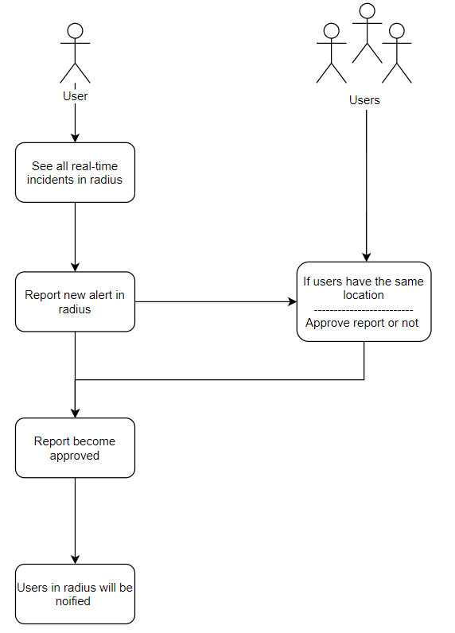

**The application displays all incidents (accidents, hurricanes, crashes, etc.) in a radius of person**

_Idea came from Citizen app: https://en.wikipedia.org/wiki/Citizen_(app) that does not work in Ukraine._

### Basic functionality
* Registration, authentication, JWT authorization.
* Ability to see all real-time incidents by yourself.
* Ability to post new alerts, providing text description and photos.
### Advanced features
* Ability to record real-time video stream, where incident happened.

### Technologies

#### Back-end
* Koa
* Docker
* WebSocket
* PostgreSQL
* AWS

### Data flow

**How can user report a safety alert?**
* User will post new alerts in radius, where an incedent happened, providing text and photos (or video stream in advanced plans)
* Then, other users will approve this alert or not.

**How many users have to approve alert?**
* less than 50% people in radius, where incedent happened -> point on the map become grey color.
* more than 50% people in radius, where incedent happened -> point on the map become yellow color.
* more than 75% people in radius, where incedenet happened-> point on the map become red color.

